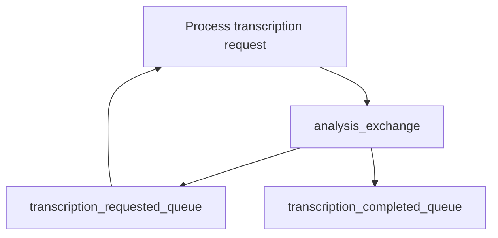

# Microservices Node.js Template

A transcription microservice to handle transcription needs for [UXcaptain](https://uxcaptain.com) - a video & audio based user research platform

## Features

- **Express.js** - Web framework for Node.js
- **LavinMQ** - Message broker integration for asynchronous communication
- **Docker** - Containerization support with multi-stage build
- **Environment Configuration** - Configuration management with `.env` files

## Getting Started

### Prerequisites

- Node.js (version specified in Dockerfile)
- npm (comes with Node.js)
- Docker
- Access to a LavinMQ server

### Environment Variables

Create a `.env` file based on `.env.example`:

### Running the Service

#### Local Development

```bash
npm run start
```

This will start the service with file watching enabled and load environment variables from `.env`.

#### With Docker

via docker Compose

### Consuming Messages

The service automatically consumes messages from the `transcription_requested_queue` and processes them based on their type:

## Technical Architecture



## Logging

TODO -- IMPLEMENT LOGGING
