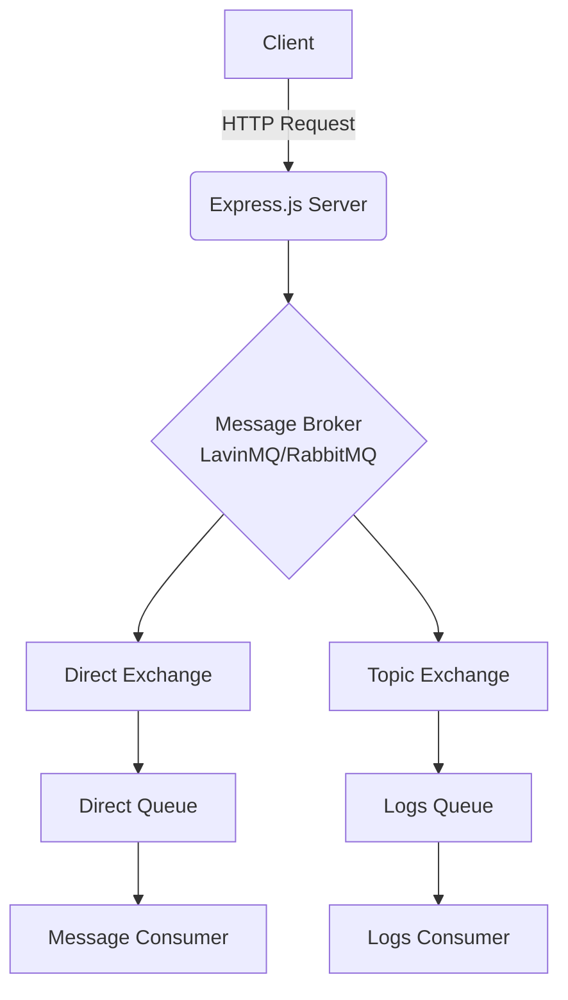

# Microservices Node.js Template

A robust template for building microservices with Node.js, featuring message broker integration, logging, and Docker support.

## Features

- **Express.js** - Web framework for Node.js
- **LavinMQ** - Message broker integration for asynchronous communication
- **Docker** - Containerization support with multi-stage build
- **Environment Configuration** - Configuration management with `.env` files

## Project Structure

```
.
├── index.js                 # Main application entry point
├── Dockerfile              # Docker configuration
├── package.json            # Project dependencies and scripts
├── .env.example            # Example environment variables
├── config/
│   └── messageBroker/      # Message broker configuration
│       └── LavinMQ.js
├── middleware/
│   └── globalErrorHandler.js  # Global error handling middleware
└── cron/
    ├── cronJobScheduler.js    # Cron job scheduler
    └── jobs/                  # Cron job implementations
```

## Getting Started

### Prerequisites

- Node.js (version specified in Dockerfile)
- npm (comes with Node.js)
- Docker (optional, for containerization)
- Access to a LavinMQ server

### Environment Variables

Create a `.env` file based on `.env.example`:

```env
PORT=3000
LAVINMQ_HOST=amqp://localhost
```

### Installation

1. Clone the repository:
   ```bash
   git clone <repository-url>
   ```

2. Install dependencies:
   ```bash
   npm install
   ```

### Running the Service

#### Local Development

```bash
npm run start
```

This will start the service with file watching enabled and load environment variables from `.env`.

#### With Docker

1. Build the Docker image:
   ```bash
   docker build -t microservice-nodejs-template .
   ```

2. Run the container:
   ```bash
   docker run -p 3000:3000 --env-file .env microservice-nodejs-template
   ```

## Usage Examples

### Publishing Messages

The template includes examples of publishing messages to queues:

```javascript
// Publish to direct queue
publishDirect('{"text":"hello", "id": "123", "type": "case1"}')

// Publish to logs queue
publishLogs('{"timestamp": "2025-11-01T16:00:00Z", "service": "transcription-service", "level": "INFO", "message": "exampleMessage", "event":"exampleEvent", "environment": "production"}')
```

### Consuming Messages

The service automatically consumes messages from the `example_direct_queue` and processes them based on their type:

```javascript
switch (content.type) {
  case 'case1':
    console.log('Processing case1 message')
    // doSomething();
    break;
  
  case 'case2':
    // doSomething();
    break;
  
  default:
    console.log(`[⚠️] Unknown message type: ${content.type}`);
    break;
}
```

## Technical Architecture



## Design Patterns

### Singleton Pattern

The message broker connection uses a singleton pattern to ensure only one connection is established:

```javascript
let connection;
let channel;

export const connectToMessageBroker = async () => {
  // Reuse existing connection if available
  if (connection) return { connection, channel };
  
  // Establish new connection
  const amqp = new AMQPClient(process.env.LAVINMQ_HOST);
  connection = await amqp.connect();
  channel = await connection.channel(100);
  // ... rest of setup
}
```

### Publisher-Subscriber Pattern

The message broker implementation uses the Publisher-Subscriber pattern for asynchronous communication:

```javascript
// Publisher
await exampleDirectQueue.publish(message);

// Subscriber
const consumer = await exampleDirectQueue.subscribe({ noAck: false }, async (msg) => {
  // Process message
  await msg.ack(); // Acknowledge message
});
```

### Middleware Pattern

Error handling is implemented using the middleware pattern:

```javascript
// Global error handler middleware
app.use(globalErrorHandler);
```

## Logging

The template sends logs to a dedicated queue for centralized logging

## Graceful Shutdown

The service implements graceful shutdown to ensure proper cleanup:

```javascript
const gracefulShutdown = () => {
  console.log('Received shutdown signal, closing server...');
  server.close(() => {
    console.log('Express server closed');
    process.exit(0);
  });
  
  // Force shutdown after timeout
  setTimeout(() => {
    console.error('Could not close connections in time, forcefully shutting down');
    process.exit(1);
  }, 10000);
};

process.on('SIGINT', gracefulShutdown);
process.on('SIGTERM', gracefulShutdown);
```

## Contributing

1. Fork the repository
2. Create a feature branch
3. Commit your changes
4. Push to the branch
5. Create a Pull Request

## License

This project is licensed under the ISC License.
